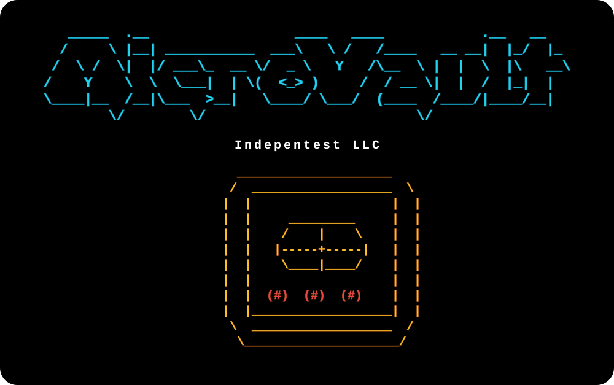

<p align="center">
  
</p>

<p align="center">
  <b>Your API keys, encrypted, offline, on your terms.</b>
</p>

<p align="center">
  <a href="https://pypi.org/project/microvault/"></a>
  <a href="https://pypi.org/project/microvault/"></a>
  <a href="LICENSE"></a>
</p>

---

Let's be honest: you've probably got API keys scattered everywhere. 🫠 A few in a `.env` file. One or two pasted straight into a shell script you meant to clean up. Maybe one sitting in your `.zshrc` in plain text, right where anyone glancing at your screen (or anything that gets its hands on your dotfiles) can read it.

MicroVault fixes that with the simplest thing that could possibly work: one encrypted file, one password only you know, and a CLI that gets your keys in and out without ever leaving them lying around.

No account to create. No server to trust. No cloud sync to worry about getting breached. It's just you, your terminal, and a vault that only opens for you.

## 🔐 What's actually happening under the hood

- Your master password runs through **PBKDF2-SHA256 with 600,000 iterations** to derive an encryption key — that's deliberately expensive, so brute-forcing it isn't cheap either.
- Every key is encrypted at rest with **Fernet** (AES-128-CBC + HMAC-SHA256), which means the vault file isn't just unreadable without the password — it's tamper-evident too.
- Writes are **atomic**. If your machine crashes or loses power mid-save, you get the old file or the new file, never a corrupted mess in between.
- Every save **auto-snapshots a backup**, so "oops, I didn't mean to delete that" is a `restore` away, not a disaster.
- Your master password is **never written anywhere**. Not to disk, not to a log, not to memory longer than it has to be. If you forget it, nobody — including us — can get your keys back. That's the deal: real security means real consequences for losing the password.

## ✨ Why you'll actually want to use this

- **Add a key without it ever touching your screen.** API key entry is a hidden prompt, same as typing a password — it never echoes, never lands in your shell history.
- **Name your services whatever you want.** `openai`, `aws`, `that-weird-internal-tool`, doesn't matter — there's no fixed list to fight with.
- **Bulk import from an existing file.** Already have a pile of keys in a text file? MicroVault's importer handles `NAME=value`, `NAME: value`, `NAME value`, even `export NAME=value` — and it shows you exactly what it parsed *before* touching your vault.
- **Pull keys straight into your shell**, on demand, without ever putting a plaintext secret in your `.zshrc`:

  ```bash
  eval "$(microvault env)"
  ```

  One line, and every stored key becomes a real environment variable for that session — gone the moment you close the terminal.
- **Other tools can call their APIs straight from what's in MicroVault** — no copy-pasting a key into a separate config file somewhere else. The catch: a lot of real tools expect a specific env var name that isn't the obvious one (WPScan wants `WPSCAN_API_TOKEN`, VirusTotal's CLI wants the genuinely odd `VTCLI_APIKEY`, `gh` wants `GH_TOKEN`). The `alias` command fixes that — set the exact name a tool expects once, and `microvault env` exports it correctly from then on:

  ```bash
  > alias wpscan
  Export name for wpscan (suggested: WPSCAN_API_TOKEN — press Enter to accept):
  wpscan will now export as WPSCAN_API_TOKEN.
  ```

  MicroVault recognizes a handful of common tools and suggests the right name — but `alias` always accepts anything you type, so this works for literally any tool, known or not.
- **An arrow-key menu if you don't feel like typing.** Hit Enter at the prompt with nothing typed, and you get a navigable list. Prefer typing `add openai` directly? That still works exactly the same.
- **Colorful, readable output** — because staring at a wall of monochrome CLI text all day is nobody's idea of a good time.

## 🚀 Try it

```bash
pip install microvault
microvault
```

That's it. First run asks you to set a master password, and you're in.

```bash
> add openai
API Key (input hidden): ••••••••••••••••••••••
Saved openai.
```

## 📦 Storage

Everything lives at `~/.microvault/` by default. Want it somewhere else? Set `MICROVAULT_HOME` and it follows you there.

## 📄 License

Apache License 2.0 — see [LICENSE](LICENSE).
